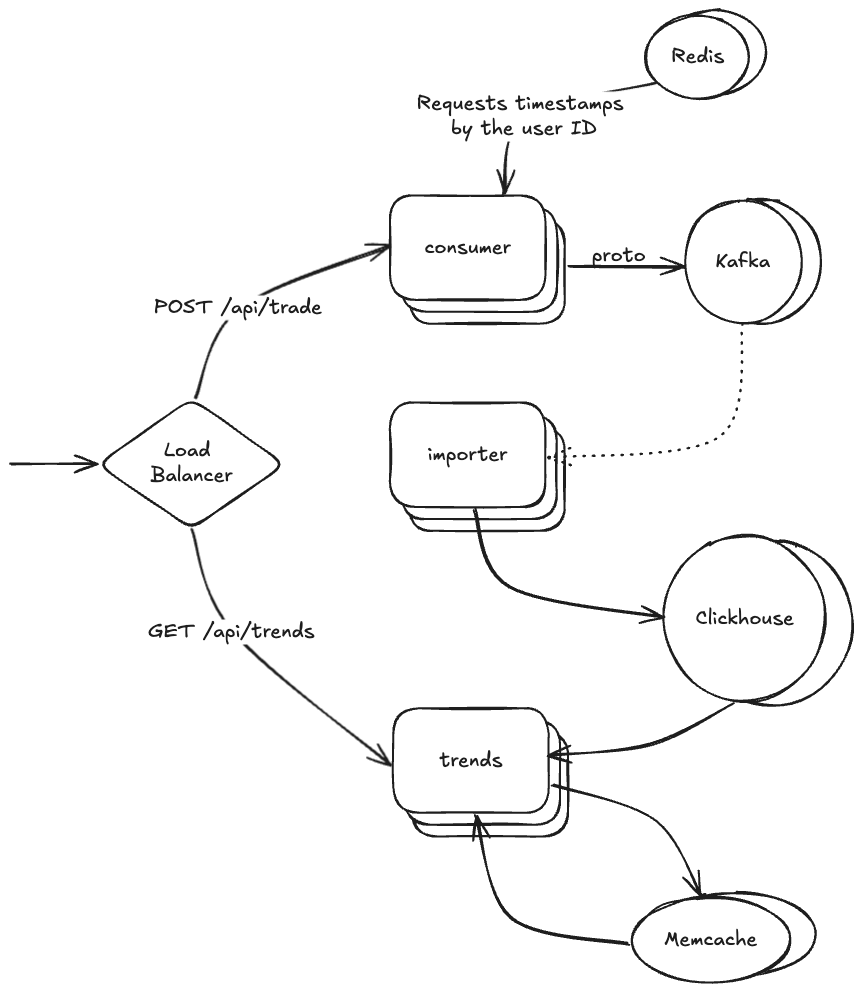

# currency-market-pulse

A demo project that aims to show the usage of the following technologies:
* Microservice architecture
* REST
* Protobufs
* Kafka
* Clickhouse
* Memcache
* Load Balancer using nginx
* Rate Limiter using Redis sorted sets
* Docker and Docker Compose

## Requirements

Currency market trade processor consumes trade messages via an endpoint, processes those messages in some way and 
delivers a frontend of processed information based on the consumed messages.

### Consumption

The trade messages are POST’d to a REST endpoint and take the JSON form of:
```json
{
    "userId": "134256", 
    "currencyFrom": "EUR", 
    "currencyTo": "USD", 
    "amountSell": 1000, 
    "amountBuy": 1093.47, 
    "timePlaced" : "12-AUG-24 11:23:45", 
    "originatingCountry" : "US"
}
```
Then the trade messages are sent to Kafka for further processing. 

### Processor

The trade messages are consumed from Kafka and stored to a Clickhouse DB in batches.

### Frontend

A frontend can consume currency exchange trends via a REST endpoint. Responses are cached using memcache.

## System Design



## Develop

### Run all services

```shell
docker compose up
```

### Generate protobufs

```shell
protoc --go_out=./proto-gen ./proto/currencymarket.proto
```